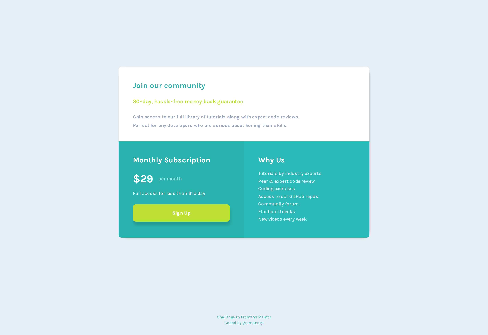

# 👩‍💻 Single price grid component

## The challenge

The challenge is to build out this single price grid component and get it looking as close to the design as possible.

Users should be able to:

- View the optimal layout for the component depending on their device's screen size
- See a hover state on desktop for the Sign Up call-to-action

## Built with

- Semantic HTML5 markup
- CSS custom properties
- Flexbox
- CSS Grid
- Mobile-first workflow

  <h3>
    <a href= "https://amansgz.github.io/single-price-grid-component/">
      Live site
    </a>
     | 
    <a href= "https://www.frontendmentor.io/challenges/single-price-grid-component-5ce41129d0ff452fec5abbbc/hub">
      Challenge
    </a>
  </h3>

This application/site was created as a submission to <a href= "https://www.frontendmentor.io/">Frontend Mentor Challenges</a> 
